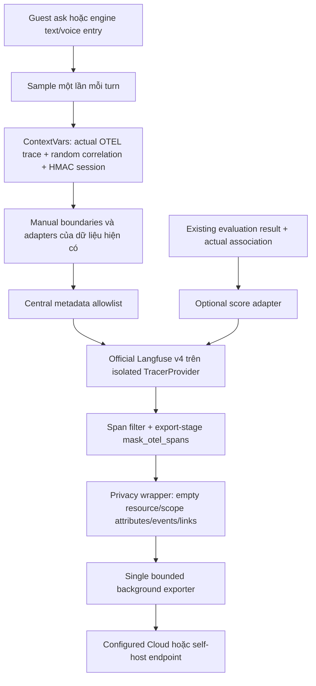

# WP14 — Langfuse observability cho Resort Voice Agent

Ngày xác minh: 2026-10-09. Branch `phase4-handoff`, HEAD trước/sau triển khai
`e8da86b602dcb38c5b4871396f80e299a4d22c03`. Python 3.12.3.

Triển khai optional Langfuse Python **4.17.0**, SDK v4/OpenTelemetry, metadata-only.
Không thay evaluation engine, authorization, transport deadlines hoặc transaction ordering.
**CLOUD_INGESTION_NOT_VERIFIED**: chỉ xác minh offline/mock và SDK với exporter trong bộ nhớ.
Không gửi trace lên Cloud, không dùng credentials thật, **0 real Qwen HTTP calls**.

## A. Existing observability audit

Đã đọc `CLAUDE.md`, `AGENT.md`, WP11 (`AGENT-CPU-NLU-OPTIMIZATION.md`),
WP12 (`AGENT-WP12-REAL-NLU-VALIDATION.md`) và WP13 (`AGENT-WP13-SEMANTIC-GROUNDING.md`).
Working tree ban đầu chỉ có `docs/AGENT-CORRECTNESS-AUDIT.md` untracked; giữ nguyên file này.
Không reset/stash/revert, commit/push hoặc sửa CI. Những thay đổi WP14 chưa commit.

| Existing component | Existing telemetry | Langfuse mapping | Gap / cách bổ sung |
|---|---|---|---|
| FastAPI `/api/session`, `/api/ask` | Session ownership, CSRF, response/tool route | Một root `guest_turn` cho `/api/ask`, keyed session pseudonym | Cần turn context mới; không trace việc cấp token, không export token |
| Conversation engine, text/voice entry | Turn outcome, pending task, verified anchors, failure class | `understanding`, `route_projection`, `memory_resolution`, `final_response` | Manual boundary; scope của API và engine reuse cùng root |
| Fast router/service selector | Actual route/candidate list | `fast_router`, `candidate_selection` | Boundary mới, adapter chỉ lấy candidate count |
| WP11 Structured Command NLU | Parsed command stream, outcome callback, schema validation | `qwen_nlu`, `model_proposed`, `server_validated` | Adapter của command đã parse; không serialize command.public() |
| Custom Ollama (`local_http`, `local_ai`, semantic `_chat`) | Loopback transport, timeout/cancel/circuit checks; `_model_answer` có provider counters | Generation `model_call` | Instrument semantic transport và generation transport; reuse parser counters, không sửa `local_http`/`local_ai` |
| WP13 semantic gate | `command_supported`, rejection reason, signed domain profile | `semantic_authorization`, `semantically_authorized` | Boundary mới, adapter bool/reason/version/digest; không export evidence text |
| Governed AgentRun | `trace()` trajectory, tool observations, failures, decisions, verified write totals | `agent_execution`, `tool_execution`, additive actual trace/correlation IDs | Reuse run/observation data, không tạo một trajectory engine khác |
| LangGraph | `verify_goal`, `plan_next_action`, `execute_tool`, routing | `langgraph_execution` và actual node spans | Manual sanitized boundaries; không bật CallbackHandler/state capture |
| RAG retrieval/grounding | Retrieval result mode, sources, rerank status/ms, evidence quality, bound citations | `retrieval`, `citation_validation` | Adapter result + actual top-k/candidate/RRF; không retrieval bổ sung |
| Conversation memory | Session-keyed TTL context, anchors, invalidation, references | `memory_lookup`, `memory_resolution` | Adapter các check đang chạy; không snapshot/preferences/conversation |
| Proposal/confirmation | Authoritative prepare/confirm, ownership, replay flag, persisted request receipt | `prepare`, `confirmation`, `verified_write_receipt` | Observe sau return của workflow; HMAC proposal/request links xuyên request |
| Change/staff workflow | Review result, change proposal, transitions, replay | `proposal_review`, `modification`, `cancellation`, `staff_review`, `status_transition` | Boundaries mới; không staff actor/note/payload; staff root không gán guest session |
| `runtime/metrics.py` | Bounded latency/throughput histograms, percentile upper bounds | Optional score adapter cho numeric summaries đã có | Giữ nguyên metrics store; không giả upper bound thành exact percentile |
| Existing evaluation harness/scripts/datasets | Trajectory/task journey scores, command rates, recall/MRR, tool/voice metrics | `export_existing_scores` | Optional adapter; không evaluator mới, không upload datasets hoặc tự chạy benchmark |

Existing `AgentRun.trace()` là structured trajectory ứng dụng, không phải OTEL trace ID.
WP14 bổ sung ID chuẩn SDK và internal correlation ID, chuyển tiếp observations hiện có.
Không dùng nonce, guest identity, room number hoặc session token để tạo trace ID.

## B. Architecture và failure isolation



Hierarchy thực tế là các observations tương ứng bước đã chạy, ví dụ:

```text
guest_turn
  understanding
    fast_router / candidate_selection
    qwen_nlu
      model_call (generation, invocation_type=NLU)
      model_proposed
      command_validation
        server_validated
        semantic_authorization
        semantically_authorized
  route_projection
  memory_resolution / memory_lookup
  agent_execution
    langgraph_execution
      verify_goal / plan_next_action / execute_tool
        tool_execution
          retrieval / citation_validation / prepare
  final_response

business_workflow (HTTP request khác)
  confirmation
    verified_write_receipt
```

Các command stage là child observations có `command_index`; `semantic_authorization`
là lời gọi gate thực tế, còn `semantically_authorized` là kết quả command stage.
Các gate kiểm tra lại ở runtime chỉ xuất hiện nếu business code thực sự gọi lại.
Không có manual span song song với LangGraph auto callback: callback **không được cài/bật**.
SDK filter còn loại auto spans thiếu marker `metadata_only`, names ngoài catalog,
exception events, links hoặc status description. Không cố sanitize arbitrary graph state để bật callback.

Root dùng SDK-generated 32-hex trace ID và không có remote parent. Child dùng actual
trace ID + 16-hex parent observation ID. ContextVars được restore trong `finally`,
bao gồm failure/cancellation và thread context propagation của API.
Internal correlation ID là random 32-hex, không chứa identity.
Proposal/request/source/session links là HMAC-SHA256 có category separation.
Confirmation ở request khác tạo root mới; liên kết bằng `proposal_link`/`request_link`,
không giả parent-child sau khi proposal trace đã đóng.
Sampled guest response và AgentRun trajectory có additive `observability` association;
disabled/unsampled response không thêm association.

Business function chạy đúng một lần. Telemetry start/update/end/export lỗi được cô lập;
broken root suppress subtree để tránh orphan roots. Không chờ flush trong guest request,
không telemetry retry model/tool/confirmation. Exception messages không được ghi vào trace.
Model parser đọc các provider events vốn đang đọc; không thêm stream reads, inference,
transport retries, timeout hoặc cancellation checks cho telemetry.

Exporter là một OTLP HTTP sink duy nhất được SDK quản lý, thông qua privacy wrapper;
không cài global provider hoặc exporter thứ hai. Network export ở background, timeout
1 giây, batch 64, flush interval 1 giây; retry hữu hạn của thư viện OTLP bên dưới.
OTEL batch queue mặc định 2048 spans; SDK score queue hữu hạn 100000 entries, enqueue
không blocking và có drop khi full. Deployment cần kiểm soát OTEL environment overrides.
Ứng dụng không giữ raw payload trong exporter queue.
Shutdown gọi từ `asyncio.to_thread`, idempotent, chờ tối đa 1,5 giây ở boundary ứng dụng;
SDK shutdown chạy trong một daemon helper, provider không đăng ký automatic exit shutdown.
Nếu SDK cleanup chậm, ứng dụng không đợi vô hạn; số telemetry cuối có thể mất.

SDK v4 cache resources theo public key. Integration kiểm tra resource provider đúng isolated
provider vừa cấp; nếu SDK reuse client/provider khác, fail closed thành disabled thay vì kế
thừa exporter/privacy policy ngoài kiểm soát. Check internal property này gắn với exact SDK pin
và có real SDK test. Một project nên có một app/client owner mỗi process; đổi owner cần restart.
SDK/OTLP logger được privacy filter: drop debug, giữ severity warning/error với generic message,
loại args/exception/stack text. Vì vậy `LANGFUSE_DEBUG=true` không làm public key hoặc HTTP
response body xuất hiện trong log. Không dùng exporter diagnostics làm business source of truth.

## C. Configuration

Cài optional dependency trong môi trường triển khai được phép: `pip install -e ".[observability]"`.
Không cần cài SDK để chạy disabled mode. SDK 4.17.0 được kiểm tra với Python 3.12.3;
isolated test install dùng SDK dependencies/OTEL 1.45.1, không nâng global môi trường hiện tại.
Không dùng tracing APIs legacy.

| Environment variable | Default | Contract |
|---|---|---|
| `LANGFUSE_ENABLED` | `false` | Disabled không import SDK/tạo sender/exporter/socket |
| `LANGFUSE_PUBLIC_KEY` | empty | `SecretStr`, excluded repr; không log/trace/report |
| `LANGFUSE_SECRET_KEY` | empty | `SecretStr`, excluded repr; không hardcode |
| `LANGFUSE_BASE_URL` | empty | Explicit HTTP(S) endpoint; reject URL credentials/query/fragment |
| `LANGFUSE_TRACING_ENVIRONMENT` | `development` | Export allowlist: development/test/staging/production; custom value không export |
| `LANGFUSE_SAMPLE_RATE` | `0.1` | [0,1], sample một lần/turn; zero/invalid/nonfinite => disabled |
| `LANGFUSE_PSEUDONYM_KEY` | empty | Optional secret >=32 characters; không export |

Khi enabled nhưng thiếu key/base URL, SDK không import được, backend initialization lỗi,
hoặc pseudonym key quá ngắn: safe disabled, Agent vẫn khởi động. Không startup auth probe.
Credentials không hợp lệ chỉ được biết khi export; async failure không cấp/revoke business authority.
Không tự đăng ký account, endpoint hoặc tự bật bằng credentials. Self-host chỉ đổi base URL.
Settings typed process-only nằm trong settings contract; không thay signed agent/runtime profile.
Frontend không kết nối Langfuse trực tiếp.

Không đặt pseudonym key: random process key, session/link correlation không ổn định qua restart.
Muốn proposal-confirmation/session correlation qua workers/restarts, provision một deployment
secret chung >=32 characters. Luân chuyển key sẽ chủ động ngắt liên kết cũ.
Không log raw session/key để debug correlation. Không có raw-output debug opt-in trong WP14.

## D. Trace catalog và centralized privacy policy

| Span | Metadata cho phép | PII policy | Source |
|---|---|---|---|
| `guest_turn`, `business_workflow` | Random correlation, keyed session nếu có, latency; actual route/counts ở guest root | Không query/token/identity | API/engine/workflow decorators |
| `understanding`, `fast_router`, `candidate_selection` | Latency, actual candidate count, pending continuation bool | Không utterance/candidate text | Existing understanding pipeline |
| `qwen_nlu` | Actual outcome, proposed command count | Không prompt/JSON/output | `model_commands` existing outcomes |
| `model_call` generation | Configured model name, primary pinned digest nếu có, invocation type, WP11_compact schema, provider token counts và prompt/generation/total ms, safe failure class | Không messages, headers, raw content/errors | Semantic custom `_chat_transport`, grounding transport/parser |
| `model_proposed`, `server_validated`, `semantically_authorized` | Index, registered type/goal/slot names, accepted/rejected, reason, WP13 policy/profile digest, proposal allowed | Không slot values/preference values/evidence | Parsed commands và actual validation/gate |
| `semantic_authorization` | Type/goal, outcome/reason/evidence category, policy/digest | Không verbatim evidence; không live ground truth | Existing `command_supported` |
| `route_projection` | Actual route, latency | Không user context | Engine command-to-route projection |
| `memory_resolution`, `memory_lookup` | Anchor existed/accepted, TTL, session ownership, reference accepted/rejected/ambiguous/none, invalidation/pending continuation | Không snapshot/preferences/title/query; cross-session lookup không lộ existence/TTL | Existing memory checks và reference rewrite |
| `agent_execution`, `langgraph_execution`, node spans | Latency, actual graph route | Không AgentRun/state serialization | Runtime/graph actual boundaries |
| `tool_execution` | Registered capability, status/verified/failure/authority, receipt write count, confirmation required | Không tool args/raw payload/database records | Existing tool observation adapter |
| `retrieval` | Mode, top-k/candidates/source counts, HMAC source links tối đa10, actual RRF/rerank status/ms/evidence quality; answerable khi có admitted sources, abstention reason từ quality/mode | Không document/chunks/query | Existing retrieval result |
| `citation_validation` | Counts, bound citation verified bool | Không citation text/chunks | Existing binding result |
| `prepare`, `modification`, `proposal_review`, `cancellation` | Action type/status, proposal/request HMAC, confirmation required, prepare write count0 | Không nonce/details/room/contact | Actual authoritative workflow |
| `confirmation`, `verified_write_receipt` | Explicit confirmed bool, authority outcome, verified returned receipt, write count1 hoặc replay0, idempotent flag, keyed links | Không ticket payload/session token | Actual confirm return, sau transaction |
| `staff_review`, `status_transition`, `emergency_alert` | Action type/status, request link nếu input có, idempotent replay/failure | Không actor/note/alert details; staff không gán guest session | Actual staff/emergency workflow |
| `final_response` | Actual route, failure class, proposal/write/citation counts | Không response content | Final API/engine result adapter |

Chỉ scalar closed enums, bounded numbers/bools, registered identifiers và keyed hashes
được qua `sanitize`. Nested dict/list bị loại, ngoại trừ lists slot names/HMAC source IDs
được kiểm tra từng item. Unknown fields bị drop, không serialize toàn object rồi redact.
Layer export-stage `mask_otel_spans` delete toàn bộ arbitrary attributes, sau đó set lại
allowlist. SDK input/output, prompts, nested model/state/memory, HTTP errors/tokens không đi qua.
Private exporter strip resource attributes, SDK instrumentation scope public key, events/links;
credentials chỉ dùng transport authentication đến endpoint đã cấu hình, không nằm trong spans.
Synthetic PII tests bao gồm nested state, model output, room, phone, email, card, passport,
raw session token và exception messages. Không training/golden dataset upload.

`business_writes` ở confirmation/receipt đếm service receipt của lời gọi này, không proposal,
audit hoặc checkpoint SQL rows. Staff/cancellation spans không bịa write count khi return contract
không cung cấp receipt tương ứng. Span timing quan sát latency bước thực thi, không thay histogram
hoặc business source of truth. Không suy diễn token counts/tokens/sec khi provider không báo.
Malformed command không parse được chỉ có NLU outcome; không chế command-stage spans cho object
không tồn tại. Missing/NOT_RUN bước không có execution span giả.

## E. Reuse evaluation scores

`runtime/evaluation_observability.py::export_existing_scores` nhận `.public()` của existing
TrajectoryScore/TaskJourneyScore hoặc flat metric slice từ existing report. Caller opt-in,
không tự chạy evaluation hay tự upload lúc khởi động. Harness, evaluation scripts, datasets,
gold/holdout và release gates giữ nguyên.

| Existing scores | Langfuse name/type | Meaning preserved |
|---|---|---|
| `task_success` | Cùng tên, BOOLEAN, bool=>0/1 | Existing harness decision |
| `steps_to_completion`, `read_calls`, `planner_calls`, `grounded_fact_count`, `turns_to_completion` | Cùng tên, NUMERIC | Count |
| `denied_action_proposal_rate`, `unauthorized_execution_rate`, `unauthorized_action_rate`, `recovery_rate`, `loop_rate`, `unexpected_action_rate`, `wrong_answer_with_citation_rate` | Cùng tên, NUMERIC | Existing rate/alias, không đổi scale |
| `route_accuracy`, `selection_accuracy`, `typed_parameter_accuracy`, `db_accuracy`, `tool_accuracy`, `slot_accuracy` | Cùng tên, NUMERIC | Chỉ khi actual report cung cấp |
| `selector_hit`, `parsed`, `command_mode`, `command_kind`, `fallback_mode`, `fallback_answered` | Cùng tên, NUMERIC | Existing command-understanding rate slice |
| `r1`, `r3`, `r5`, `mrr` | Cùng tên, NUMERIC | Existing retrieval report; không rename thành invented recall score |
| `wer` | Cùng tên, NUMERIC | Existing voice metric, không rescale |
| `p95_latency_ms`, `first_audio_p50_ms`, `first_audio_p95_ms` | Cùng tên, NUMERIC | milliseconds |
| `p50_upper_ms`, `p95_upper_ms`, `p99_upper_ms` | Cùng tên, NUMERIC | Histogram upper bound, không exact percentile |
| `p50_upper_tokens_per_sec`, `p95_upper_tokens_per_sec`, `p99_upper_tokens_per_sec` | Cùng tên, NUMERIC | Existing model-reported throughput upper bounds |
| `budget_exhausted` | Cùng tên, CATEGORICAL | Existing wall_time/steps/read_calls/planner_calls; null skipped |

Unknown names, null/nonfinite scores bị skip. Không fake scores/ground truth,
không LLM-as-a-Judge, không Qwen để chấm lại. Live metadata không có `expected_goal`.

Caller phải cung cấp actual trace ID hoặc session pseudonym đã liên kết, một persisted
evaluation result ID và timezone-aware result timestamp. Không association => `unlinked`,
không fabricate production trace. Deterministic `score_id` hash evaluation ID + association +
metric name, fixed result timestamp được gửi lại: SDK v4 server dedupe ID/name/timestamp date.
Caller phải reuse timestamp của result, không thay bằng thời điểm export. Mock kiểm tra cùng
payload/score ID/date qua re-export; **server-side dedupe và Cloud score ingestion chưa xác minh**.
`queued` nghĩa là enqueue, không nghĩa là server đã nhận score. SDK queue drops có thể không
được phản ánh trong return của enqueue; không dùng export status làm evaluation gate.

Ví dụ usage sau khi evaluator hiện có đã tính result, không chứa nội dung dataset:

```python
export_existing_scores(
    app.state.observability,
    existing_task_journey_score,
    evaluation_id=persisted_result_id,
    evaluated_at=persisted_result_timestamp,
    trace_id=actual_guest_response["observability"]["trace_id"],
)
```

Cho aggregate/multi-turn evaluation, caller chịu trách nhiệm chọn đúng association có thật.
Adapter không tự lấy trace cuối rồi gán toàn offline suite vào đó. Disabled/sample-zero adapter
không enqueue. Flat metric slices giữ nguyên scale/unit của evaluator nguồn.

## F. Code changes

| Files thực tế | Lý do |
|---|---|
| `pyproject.toml`, `.env.example`, `core/settings.py` | Pinned optional SDK, typed fail-closed process settings, disabled defaults |
| `runtime/observability.py` (new) | SDK backend, correlation/sampling, centralized privacy/masking, safe boundaries, finite shutdown |
| `runtime/evaluation_observability.py` (new) | Optional existing-score adapter, stable identity/date, unlinked behavior |
| `main.py`, `api/guest/routes.py`, `application/conversation/engine.py` | Lifecycle, guest root scope, actual route/memory/final-response metadata |
| `agent/understanding/{fast_router,service_selector,commands,intent_evidence,semantic}.py` | Understanding/command stages/WP13/custom transport boundaries |
| `agent/orchestration/grounding.py` | Existing stream provider metadata and actual generation boundary |
| `agent/runtime/runtime.py`, `agent/runtime/langgraph_loop.py`, `agent/runtime/execution/models.py` | Actual governed execution/tool/node spans, AgentRun association |
| `agent/runtime/planner.py`, `agent/runtime/planning/goal_interpreter.py`, `agent/memory/reference_resolver.py` | Invocation labels cho existing calls; không thêm call |
| `agent/memory/conversation.py` | Existing TTL/ownership check adapter |
| `rag/retrieval/engine.py`, `rag/grounding/citations.py` | Retrieval/result/citation metadata adapters |
| `domain/requests/{workflows,submissions,staff_ops}.py` | Optional owner, authoritative workflow boundaries và receipt links |
| `tests/agent/test_observability.py` (new) | Deterministic WP14/privacy/failure/concurrency/real SDK offline tests |
| `tools/runtime/measure_observability_overhead.py` (new) | Same-input offline parser/mock overhead evidence |
| `tests/agent/test_nlu_memory.py` | Fixture extension cần WP13 preference evidence policy, assertions nguyên trạng |
| `tests/ops/test_langgraph_durable_restart.py` | Fixture amenity proposal cần requested_item/unit theo contract hiện tại, idempotency assertions nguyên trạng |
| `tests/hardcode_allowlist.txt` | Existing protected numeric grammar line dịch41=>42 do import; không thêm exception |
| `docs/AGENT-WP14-LANGFUSE-OBSERVABILITY.md` | Audit, implementation, measured validation và limitations |

Hai fixture failures đã tái hiện trên isolated `git archive` của HEAD: preference extension
thiếu semantic authorization policy và amenity payload thiếu requested_item/unit. Baseline
hai tests đều fail trước WP14. Chỉ sửa fixture để đáp ứng contract, không sửa security checks
hay bỏ/làm yếu assertions. Existing strict rebuild xfails được giữ nguyên.

## G. Validation

Kết quả targeted chạy thực tế trên local offline runner, test profile, temporary SQLite DB,
live Ollama opener bị chặn. SDK test dependency đặt trong ignored `reports/wp14-sdk`;
test SDK dùng unique synthetic keys + in-memory/broken sink, không auth check/network.

| Check | Result |
|---|---|
| `tests/agent/test_observability.py`, SDK v4 dependency available; `-W error::ResourceWarning` | **34 passed, 0 failed, 0 skipped**, 5,14s |
| Targeted regression 11 files: semantic_authorization, command_cpu_contract, command_agent_loop, commands, change_confirmation, conversation_memory_followups, nlu_memory, durable_restart, command_evaluation_checkpoint, no_hardcode, no_case_specific_rules; `-W error::ResourceWarning` | **138 passed, 0 failed, 4 xfailed**, 27,16s |
| Config pins `tools/config/repin_configs.py --check` | Passed, hashes unchanged |
| `tools/validate/audit_data.py` | Passed structural/semantic/artifact audit; không inference/rebuild |
| `compileall` changed Python source | Passed |
| `git diff --check` | Passed; chỉ Windows LF/CRLF informational warnings |

Warnings là pytest plugin rewrite/asyncio fixture default và existing Starlette/httpx
deprecations, không test failures. Không chạy full pytest, Qwen live smoke, browser/voice
live E2E, benchmark, CI hoặc frontend build. Local logs ở ignored
`reports/wp14-observability-tests.txt`, `reports/wp14-regression-tests.txt`,
`reports/wp14-data-audit.txt`, `reports/wp14-overhead.json`.

| ID | Scenario / proof trong targeted tests |
|---|---|
| O01 | Disabled owner: SDK import forbidden, exporter constructor forbidden, request regressions hoạt động |
| O02 | Missing/malformed config/constructor credentials failure: safe disabled |
| O03 | Guest API + engine reuse: đúng một root; actual SDK root.parent=None |
| O04 | Actual governed LangGraph execution: node/tool đúng parent và trace |
| O05 | Real custom local_chat_open + mocked HTTP stream: actual provider counts/ms, một call, deadline unchanged |
| O06 | NLU TimeoutError: one attempt, finite failure class; no retry |
| O07 | Frozen WP12 water regression: hai commands rejected unsupported_semantics; API nlu_failure, no proposal/tool/business write |
| O08 | Valid amenity_delivery: model/server/semantic accepted stages |
| O09 | Actual lexical retrieval/citation bind: hashed sources/counts/evidence only, no chunks |
| O10 | Memory lookup TTL expired/ownership, no cross-session existence; existing followup regressions |
| O11 | Actual API draft: business_writes0 |
| O12 | Actual authoritative confirm: one service receipt/write |
| O13 | Duplicate confirm: same ID, replay true, receipt write count0; durable regression |
| O14 | Full/timeout/connection/DNS/401 fake failures + real SDK BrokenSink: guest response/confirmation unchanged |
| O15 | Nested synthetic model output/input/errors: absent from mock and real SDK exported attributes |
| O16 | Nested arbitrary state + SDK scope public key stripped; auto-state span/event/name filter rejects |
| O17 | Concurrent sessions threads and asyncio.to_thread: separate trace/session pseudonyms, context restored |
| O18 | Existing TaskJourneyScore + explicit rate/unit/categorical slices: BOOLEAN/NUMERIC/CATEGORICAL preserved |
| O19 | Re-export preserves score ID/payload/persisted timestamp; Cloud dedupe chưa test |
| O20 | Emergency API healthy/failing exporter, Qwen forbidden, route emergency |
| O21 | App lifecycle shutdown + stalled fake backend: bounded wait; no disabled helper |
| O22 | Zero sampling => no backend/import/export; no phantom model for pre-cancel/disabled generation |

Additional SDK privacy test bật `LANGFUSE_DEBUG=true`, kiểm tra synthetic credentials/HTTP body
không vào caplog và cached provider bị từ chối an toàn.

CallbackHandler không dùng nên không có dual instrumentation cần chạy regression callback.
Filter test chứng minh arbitrary auto captured names/state/events bị chặn thay vì bật raw capture.
Real SDK test serialize attributes/resource/instrumentation scope/events/links và assert không
guest content/session token/credentials. BrokenSink SDK test force_flush chỉ trong test,
không đặt flush trên request path. Bad-credential/network tests là deterministic failure injection,
không xác minh remote authentication, DNS hay real network outage.

## H. Performance offline/mock

Same synthetic command parser, 5 batches ×500 iterations/mode, alternating order; median
của batch mean. Counting backend không giữ payload; 15000 mock observations, 0 model/Cloud requests.

| Mode | Median batch mean per iteration |
|---|---:|
| Current instrumented parser, no active trace | 0,070702 ms |
| Same parser + disabled turn scope | 0,075868 ms |
| Same parser + enabled mock turn scope | 0,267235 ms |

Disabled scope delta **0,005165 ms**; mock enabled minus disabled **0,191367 ms**.
Đây là phép đo same-input scopes trên parser hiện tại, không phải so sánh toàn app trước/sau,
không gồm SDK/export/network latency và không thể suy ra production p95 hoặc inference speed.
Không tuyên bố instrumentation cải thiện CPU/model latency. Tool đo offline có thể chạy lại:
`python tools/runtime/measure_observability_overhead.py --output reports/wp14-overhead.json`
với source package installed hoặc `PYTHONPATH=src`.

## I. Limitations và trạng thái nghiệm thu

Offline implementation/targeted acceptance đã xác minh: optional SDK, actual root/parent IDs,
NLU/WP13/governed tool correlation, RAG/memory/business metadata, privacy, failure isolation,
confirmation/idempotency và existing score reuse. Không thêm inference/evaluator/framework/dataset.

- **CLOUD_INGESTION_NOT_VERIFIED**; real trace/score ingestion, UI dashboard và server-side
  score dedupe cần operator nghiệm thu riêng với endpoint/credentials được cấp phép.
- Real Qwen accuracy không đánh giá lại. CPU inference latency/model/deadlines không đổi.
- Live voice/browser E2E chưa nghiệm thu. Voice engine entry có instrumentation chung;
  concurrency kiểm tra offline, không nghiệm thu real websocket/audio pipeline.
- Langfuse không tự chấm semantic correctness khi thiếu labels/evaluator. WP14 không judge.
- Callback/state capture bị tắt; actual manual nodes chỉ export metadata catalog.
- Custom tracing environment không nằm trong bốn giá trị privacy allowlist sẽ không export.
- Session/proposal correlation qua restart/multiple workers cần deployment pseudonym secret chung.
- End observations/scores có thể bị drop khi sampling, full queue, outage hoặc shutdown deadline;
  Langfuse không thay SQLite receipts, metrics store, release gates hoặc evaluation source of truth.
- SDK optional extra và isolated compatible dependency set đã test; chưa nghiệm thu toàn production
  environment sau dependency resolution. Không chạy full suite/build/benchmark theo phạm vi WP14.

Tài liệu chính thức đã kiểm tra trước khi viết SDK integration:
[SDK overview](https://langfuse.com/docs/observability/sdk/overview),
[LangGraph integration](https://langfuse.com/integrations/frameworks/langgraph),
[advanced SDK features](https://langfuse.com/docs/observability/sdk/advanced-features),
[scores via SDK](https://langfuse.com/docs/evaluation/evaluation-methods/scores-via-sdk),
[Python API reference](https://python.reference.langfuse.com/langfuse).
Implementation dùng API v4 `start_observation`, explicit parent trace context,
`mask_otel_spans` sparse patches và `create_score`; không legacy tracing API.
