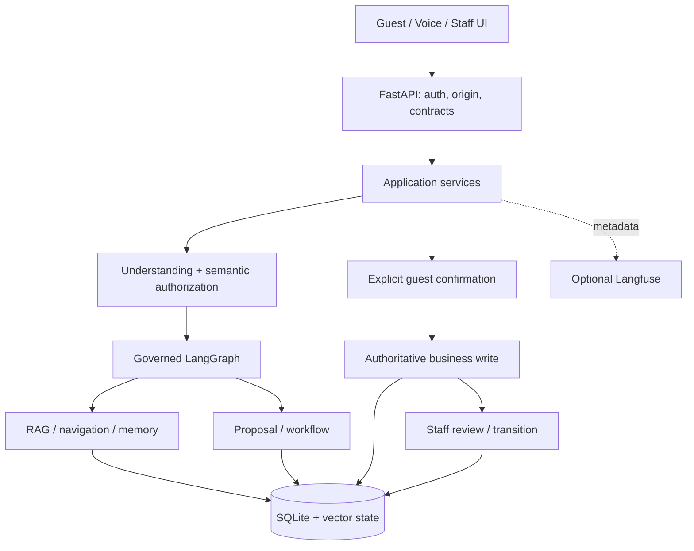

# Kiến trúc và luồng thực thi

## Thành phần

Hệ thống dùng FastAPI, SQLite và LangGraph theo mô hình một property/appliance. Frontend React được build thành assets trong `web/`. Ngôn ngữ domain hiện tại: VI/EN/ZH/KO.

`main.py` ghép dependencies và lifecycle; `bootstrap.py` validate settings và chuẩn bị runtime. API không thay domain policy; LangGraph/tool output không tự chứng minh business action đã commit.

Các module hiểu ý định và điều phối hội thoại có trách nhiệm riêng:

| Module | Trách nhiệm |
|---|---|
| [command_types.py](../src/concierge_kiosk/agent/understanding/command_types.py) | Vocabulary đóng và command value objects; không có quyền ghi |
| [command_prompt.py](../src/concierge_kiosk/agent/understanding/command_prompt.py) | Dựng prompt/catalog theo deployment; không gọi model |
| [commands.py](../src/concierge_kiosk/agent/understanding/commands.py) | Parse, validate và gọi model |
| [evidence_text.py](../src/concierge_kiosk/agent/understanding/evidence_text.py) | So khớp Unicode, giữ surface/offset và che phần trích dẫn |
| [request_scope.py](../src/concierge_kiosk/agent/understanding/request_scope.py) | Phạm vi vị ngữ, các dạng clause view và đếm chuỗi hành động |
| [intent_evidence.py](../src/concierge_kiosk/agent/understanding/intent_evidence.py) | Kiểm tra semantic support và điều kiện giữ proposal để review |
| [service_catalog.py](../src/concierge_kiosk/agent/understanding/service_catalog.py) | Validate catalog rows và tạo service candidates |
| [service_examples.py](../src/concierge_kiosk/agent/understanding/service_examples.py) | Đọc training, chuyển nhãn route cũ, kiểm tra context eligibility và label |
| [service_selector.py](../src/concierge_kiosk/agent/understanding/service_selector.py) | Semantic index, cache và ranking; không cấp authority |
| [projection.py](../src/concierge_kiosk/application/conversation/projection.py) | Chiếu command đã validate sang route và dựng confirmation/safety responses |
| [engine.py](../src/concierge_kiosk/application/conversation/engine.py) | Turn state, dependency wiring và thứ tự điều phối |

Các tên import đã dùng ở `commands.py`, `intent_evidence.py`, `service_selector.py`
và `engine.py` vẫn được re-export để giữ contract của caller. Parser canonical/legacy
vẫn có caller; wire gọn của model không thay thế hình dạng response API.

## Một guest turn

1. API xác minh origin, session/CSRF và request schema; conversation engine serialize theo session.
2. Emergency Tier1 chạy theo domain policy. Tier2 kiểm tra semantic khi selector/embedder sẵn sàng; emergency rõ ràng ưu tiên hơn draft và normal NLU. Review zone dùng `emergency_check` (ngưỡng thiên về recall); khách xác nhận thì cảnh báo, khách trả lời không phải khẩn cấp thì chính lượt đã gây câu hỏi được hiểu lại như bình thường và không hỏi lại cho lượt đó.
3. Server xử lý các boundary có đủ evidence: clear pending draft, verified booking referent, câu hỏi thông tin read-only, pending confirmation/context continuation.
4. Fast router và similarity path có thể tạo proposal grounded; nếu không đủ điều kiện, SLM đề xuất Structured Commands. ServiceSelector cung cấp candidates/examples, không cấp authority và không loại bỏ registry goals ngoài shortlist.
   - Prompt bố trí để tái sử dụng KV cache trên CPU: system message tĩnh theo deployment (hướng dẫn, mô tả hình dạng JSON của mọi command, toàn bộ catalog đã bật theo thứ tự registry) đứng đầu và được prefill lúc khởi động; model trả `format: json` (không dùng JSON-schema grammar: trên CPU tốn vài giây mỗi lượt và làm lệch một số model), server validate lại toàn bộ; few-shot là các lượt user→assistant trước đó với JSON một dòng; lượt khách luôn ở cuối. Mọi lời gọi SLM dùng chung `SLM_NUM_CTX` và `SLM_KEEP_ALIVE`.
   - Wire của model cho `StartGoal` dùng `type`, `goal`, `text` và `item` tùy chọn trong `commands`; `text` là phạm vi nguyên văn của yêu cầu. Prompt không yêu cầu `slots` array. Server mở rộng scope, validate rồi trích slots; command canonical có thể chứa `source`, `slots` và metadata do server sở hữu.
5. Server validate command/slots, semantic evidence, negation/quoted/past/question/conditional scope. Command sai bị bỏ; sibling hợp lệ được giữ khi contract cho phép.
   - Command có evidence kiểm chứng đi theo semantic gate. Nếu thiếu evidence đó nhưng đạt điều kiện `plausible_request`, validator giữ proposal với `review=true` do server đặt. Engine trả `needs_review` và có thể kèm alternatives. Không đạt cả hai điều kiện thì từ chối; cờ model gửi không cấp authority. Proposal review vẫn cần explicit guest confirmation trước service write. Code có cổng hai mức; phạm vi nghiệm thu nằm trong [Testing](TESTING.md#cổng-hai-mức-chưa-đo-trên-bộ-lớn).
   - Mỗi command được xét trên mệnh đề của chính nó (`command_scope`): span nguyên văn của model nếu nằm trong đúng một mệnh đề, mở rộng ra cả mệnh đề; nếu thiếu, không nguyên văn hoặc trùm nhiều mệnh đề (model hay lặp cả câu cho từng yêu cầu) thì lấy mệnh đề giống service của command nhất. Span sai không làm mất command; slot cũng trích trên mệnh đề đó, số phòng lấy từ cả lượt.
   - Semantic evidence có hai nguồn: (a) concept + action trong ontology đã review; (b) đồng thuận model–embedding trên mệnh đề (`semantic_agreement`): goal nằm trong `top_k` service của mệnh đề, điểm ≥ `min_score`, cách service đứng đầu không quá `max_gap`, và gần hơn lượt review không yêu cầu dịch vụ nào (câu hỏi, cảm ơn, tham chiếu mơ hồ) theo `nonrequest_margin` — giá trị ở `nlu.service_selector.semantic_agreement`, hiệu chỉnh bằng `tools/nlu/calibrate_semantic_support.py` (giữ riêng cả nhóm diễn đạt trên train). Cái gì "không phải yêu cầu" được dạy bằng lượt review, không bằng danh sách cụm từ.
   - Mệnh đề phải đang yêu cầu (`requests_now`): phủ định chỉ từ chối khi chi phối động từ yêu cầu ("không cần dọn", "don't bring", "청소하지 않아도") hoặc đối tượng của service giao đồ ("no towels"); phủ định một trạng thái ("máy lạnh không mát") hay tiểu từ hỏi ("…được không, phòng 701") không phải từ chối. Hướng chi phối theo ngữ pháp từng ngôn ngữ (`semantic_authorization.negation_scope`). Mốc quá khứ/hoàn tất, lời thuật lại và câu hỏi thông tin không cung cấp execution evidence. Yêu cầu bỏ qua xác nhận không được duyệt chỉ nhờ đồng thuận. Từ hỏi nằm trong khung yêu cầu ("could you…?", "…주실 수 있나요?") là cách hỏi lịch sự, không phải câu hỏi thông tin. Đồng thuận cho `CheckAvailability` (chỉ đọc) không áp lề "lượt không yêu cầu".
   - Ngữ pháp theo ngôn ngữ nằm trong config, không trong code: `clause_suffixes` (đuôi nối "-고" tách mệnh đề tiếng Hàn), `negation_scope`, `delivery_object_position` (đồ vật đứng trước động từ giao ở ngôn ngữ động-từ-cuối). Đồ vật mới không có trong catalog được nhận qua đường "giao đồ vật" khi có động từ giao và đồ vật khách nêu; mạo từ bất định ("a bathrobe") và số đếm đứng riêng ("가운 하나") là số lượng một/đếm được.
   - Model chỉ "đồng ý" khi không có gì đang chờ: validator bỏ lệnh đó; ở biên model, lượt chỉ có lệnh này được đáp như lời xã giao thay vì "chưa hiểu".
   - Trong lượt nhiều command, read có query không phải lời khách và `Clarify` đi kèm hành động bị bỏ như padding; đứng một mình thì vẫn giữ. Field không thuộc loại command và slot sai hình dạng bị bỏ (không mang authority); phần còn lại vẫn qua validator theo contract.
   - Lượt có từ hỏi (mấy giờ, bao nhiêu, ở đâu…) chỉ được đồng thuận semantic qua mệnh đề có động từ yêu cầu. Động từ và concept được so khớp theo dấu khi khách gõ dấu (`marker_spans`): bỏ dấu thì "sữa"/"sửa", "chỗ"/"cho" trùng chữ. `semantic_authorization.question_particles` (ví dụ "vậy" cuối câu hỏi) không bị coi là tham chiếu ngữ cảnh.
   - `SetSlot`/`CorrectSlot` chỉ áp dụng khi có câu hỏi server đang chờ hoặc draft đang mở. Nêu lại cùng service của draft đang mở với giá trị mới ("cho mình 4 chai luôn") là sửa draft đó, không tạo yêu cầu mới; số lượng nhận theo đơn vị đếm cấu hình (`nlu.slots.quantity_units`).
6. Command-to-route projection và governed execution chọn read/tool/proposal. Memory chỉ cấp anchor còn hợp lệ, owned và đúng source revision.
7. Response phân biệt thông tin, draft, clarification, failure và receipt thực tế. Lượt không hiểu kèm `service_options` (tối đa 3 dịch vụ gần nhất theo embedding, kèm slot server đọc được) để khách chọn và mở form; option không mang quyền ghi. Không hiểu execution request thì không đổi thành knowledge để tạo cảm giác thành công.

Qwen timeout/unavailable/invalid output có failure class. Deadline và cancellation thuộc transport/runtime; telemetry không retry model. Provider timings phân biệt loading, prompt evaluation và generation khi provider thực sự trả metadata.

## Authority và workflow

- Command model là đề xuất. Room/time/confidence/rank một mình không thay semantic evidence; rank chỉ là tín hiệu thứ hai đi cùng goal của model và modality guards, và mọi write vẫn cần guest xác nhận.
- `guest_confirm_all` giữ explicit consent trước service write; draft/proposal/audit event không được đếm như persisted service receipt.
- Prepare/confirm kiểm tra ownership, expiry, registry/service contract, disclosure/verification theo policy. Duplicate confirmation dùng idempotency; replay không tạo ticket thứ hai.
- Staff xử lý state transition riêng. Queued/approved chưa có nghĩa fulfilled.
- Hủy pending draft khác với hủy/đổi committed request. Request change giữ luồng review/confirmation hiện có.
- Emergency alert là workflow safety riêng; chỉ thông báo queued khi có receipt hợp lệ. Staff acknowledgement không được suy ra từ việc enqueue.

## RAG, memory và voice

Phiếu yêu cầu (màn hình và staff ticket) có thêm dòng "ghi chú" với nguyên văn lời khách, để thông tin không có slot (dị ứng, khách cần hỗ trợ gì) đến được nhân viên; phần đọc to bằng giọng nói không đọc dòng này. Giờ có buổi đứng trước ("tối nay 7 giờ") hoặc cách xa ("tối nay … lúc 7 giờ") được hiểu đúng; am/pm là ngữ pháp đồng hồ (`nlu.clock.<lang>.period`). Khôi phục dấu chỉ chạy khi câu không có dấu nào và không bao giờ áp cho token dính số ("6am").

Khi khách nêu đúng nhãn ngữ cảnh do dữ liệu sở hữu (`context_labels.json`, ví dụ "giờ trả phòng"), ngữ cảnh đó xác định fact: suy ra thực thể nếu chỉ một thực thể mang ngữ cảnh ấy, ưu tiên loại fact của ngữ cảnh hơn facet, và fact có ngữ cảnh trùng khớp được coi là trả lời được. `rag.facet_value_patterns` cho phép một fact khác loại nhưng có giá trị dạng giờ trả lời câu hỏi "mấy giờ".

Một fact ngắn đã xác minh được trả bằng locale template, không gọi SLM diễn đạt lại (trên CPU việc đó tốn vài giây, đẩy prompt command khỏi KV cache và có thể làm mất chủ ngữ); chỉ evidence nhiều fact mới được SLM tổng hợp.

RAG và anchor lifecycle được mô tả ở [RAG](RAG.md). Voice có admission/cancellation, partial/final transcription, playback proof và transport theo profile. Voice/STT/TTS cần assets đã provision; source integration không chứng minh chất lượng audio.

Checkpoints và business SQLite có vai trò riêng; reconcile xử lý orchestration sync bị deferred mà không phát lại business action tùy tiện.

NLU input normalization reads `nlu.normalization.short_forms` from the pinned
domain profile and expands whole tokens only for the explicitly selected language.
Mixed accented/unaccented input restores unambiguous catalog phrases while keeping
already typed accents and standalone grammatical/time words. URLs, emails and
tokens containing digits are excluded from abbreviation, accent, fuzzy and
repeated-letter rewrites. Each applied rewrite remains available in
`NormalizationResult.edits`; this layer does not decode malformed Telex/VNI input.

## Observability

Pipecat speech delivery advances only after the browser acknowledges an opaque
token emitted after the chunk's audio frames. The browser waits for every scheduled
audio source to finish; interruption, suspended/empty output, disconnect and a
missing acknowledgement never count as played. Chunk production waits for this
result before advancing. TTS language must match the server-owned speech lease.
Piper voices remain cached in a separate worker process; the configured TTS timeout
and cancellation cover model loading and synthesis and terminate that worker when
necessary. A later request starts a fresh worker.

Existing metrics, AgentRun/tool observations và evaluation harness là nguồn dữ liệu; Langfuse là adapter optional. Một guest turn có root và children của bước thực sự chạy. Không tạo spans cho NOT_RUN hay capture arbitrary graph state.

Correlation dùng SDK trace ID và internal IDs; session/proposal links được pseudonym hóa. Confirmation ở request khác liên kết metadata, không giả parent context đã kết thúc. HTTP request trace headers là correlation tại API, không được giả định là cùng ID với SDK.

Export metadata allowlist và masking; lỗi export không đổi authority/transaction/deadline. Xem [Operations](OPERATIONS.md), [Security](SECURITY.md), [Testing](TESTING.md).
