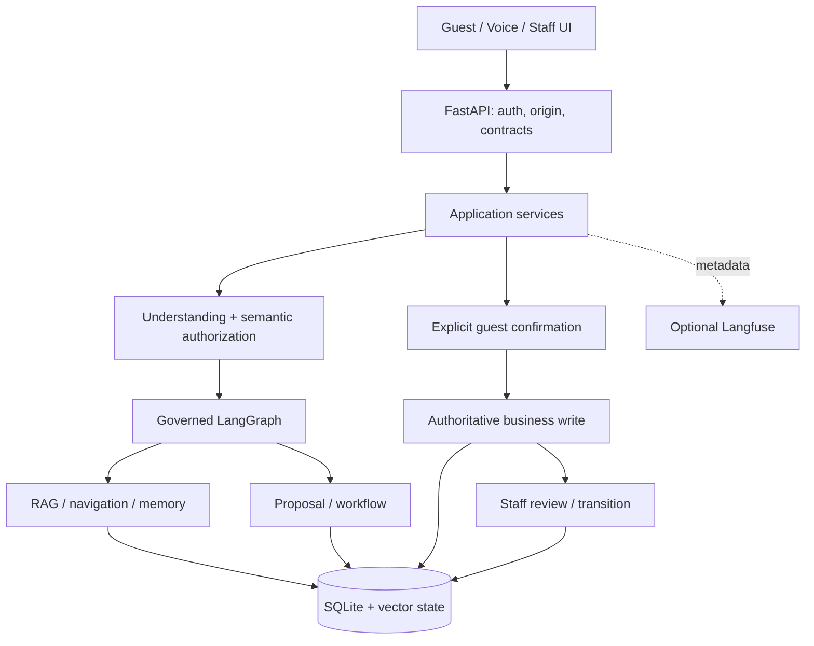

# Kiến trúc và luồng thực thi

## Thành phần

Hệ thống dùng FastAPI, SQLite và LangGraph theo mô hình một property/appliance. Frontend React được build thành assets trong `web/`. Ngôn ngữ domain hiện tại: VI/EN/ZH/KO.

`main.py` ghép dependencies và lifecycle; `bootstrap.py` validate settings và chuẩn bị runtime. API không thay domain policy; LangGraph/tool output không tự chứng minh business action đã commit.

## Một guest turn

1. API xác minh origin, session/CSRF và request schema; conversation engine serialize theo session.
2. Emergency Tier1 chạy theo domain policy. Tier2 kiểm tra semantic khi selector/embedder sẵn sàng; emergency rõ ràng ưu tiên hơn draft và normal NLU. Review zone dùng `emergency_check`.
3. Server xử lý các boundary có đủ evidence: clear pending draft, verified booking referent, câu hỏi thông tin read-only, pending confirmation/context continuation.
4. Fast router và similarity path có thể tạo proposal grounded; nếu không đủ điều kiện, Qwen đề xuất Structured Commands. ServiceSelector cung cấp candidates/examples, không cấp authority và không loại bỏ registry goals ngoài shortlist.
5. Server validate command/slots, semantic evidence, negation/quoted/past/question/conditional scope. Command sai bị bỏ; sibling hợp lệ được giữ khi contract cho phép.
6. Command-to-route projection và governed execution chọn read/tool/proposal. Memory chỉ cấp anchor còn hợp lệ, owned và đúng source revision.
7. Response phân biệt thông tin, draft, clarification, failure và receipt thực tế. Không hiểu execution request thì không đổi thành knowledge để tạo cảm giác thành công.

Qwen timeout/unavailable/invalid output có failure class. Deadline và cancellation thuộc transport/runtime; telemetry không retry model. Provider timings phân biệt loading, prompt evaluation và generation khi provider thực sự trả metadata.

## Authority và workflow

- Command model là đề xuất. Room/time/confidence/rank không thay semantic evidence.
- `guest_confirm_all` giữ explicit consent trước service write; draft/proposal/audit event không được đếm như persisted service receipt.
- Prepare/confirm kiểm tra ownership, expiry, registry/service contract, disclosure/verification theo policy. Duplicate confirmation dùng idempotency; replay không tạo ticket thứ hai.
- Staff xử lý state transition riêng. Queued/approved chưa có nghĩa fulfilled.
- Hủy pending draft khác với hủy/đổi committed request. Request change giữ luồng review/confirmation hiện có.
- Emergency alert là workflow safety riêng; chỉ thông báo queued khi có receipt hợp lệ. Staff acknowledgement không được suy ra từ việc enqueue.

## RAG, memory và voice

RAG và anchor lifecycle được mô tả ở [RAG](RAG.md). Voice có admission/cancellation, partial/final transcription, playback proof và transport theo profile. Voice/STT/TTS cần assets đã provision; source integration không chứng minh chất lượng audio.

Checkpoints và business SQLite có vai trò riêng; reconcile xử lý orchestration sync bị deferred mà không phát lại business action tùy tiện.

## Observability

Existing metrics, AgentRun/tool observations và evaluation harness là nguồn dữ liệu; Langfuse là adapter optional. Một guest turn có root và children của bước thực sự chạy. Không tạo spans cho NOT_RUN hay capture arbitrary graph state.

Correlation dùng SDK trace ID và internal IDs; session/proposal links được pseudonym hóa. Confirmation ở request khác liên kết metadata, không giả parent context đã kết thúc. HTTP request trace headers là correlation tại API, không được giả định là cùng ID với SDK.

Export metadata allowlist và masking; lỗi export không đổi authority/transaction/deadline. Xem [Operations](OPERATIONS.md), [Security](SECURITY.md), [Testing](TESTING.md).
